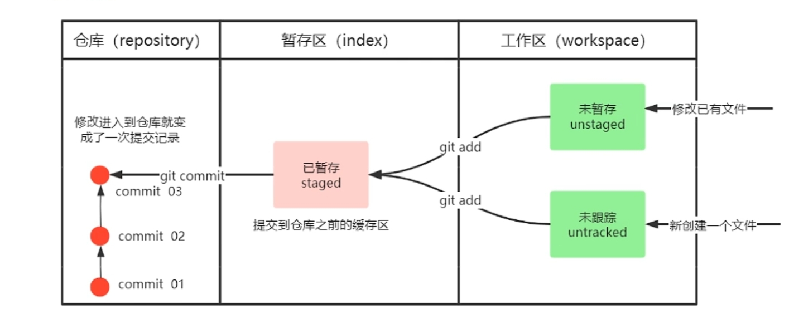
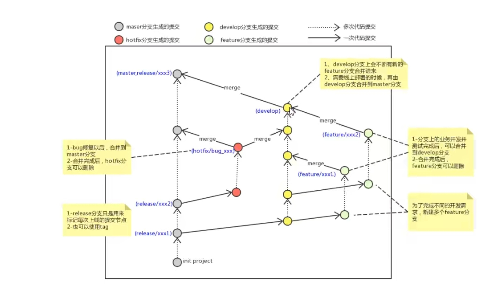
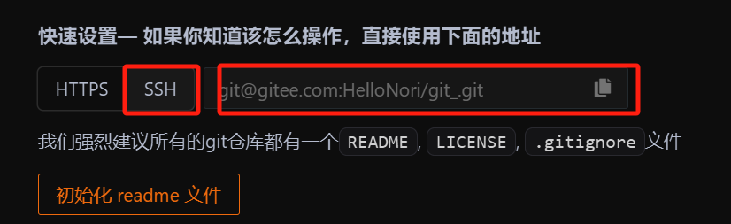
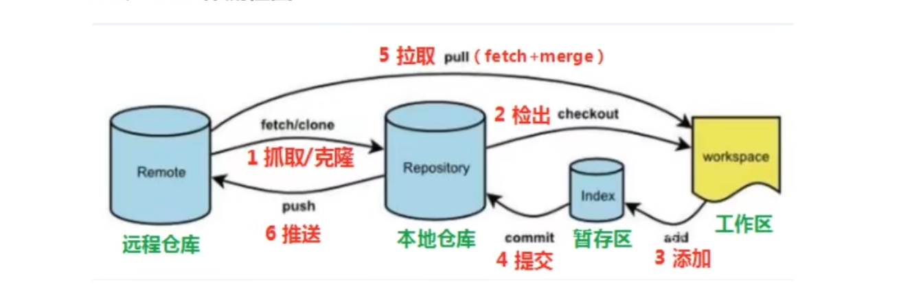

# Git

Git \-\> 备份, 代码还原, 协同开发, 追责

# 一\. Git的工作流程


# 二\. Git常用命令

## 获取本地仓库

如果要使用git对我们的项目进行版本控制, 首先需要获得本地仓库

1. 在电脑任意位置创建一个空目录作为我们本地的git仓库

2. 进入目录, 打开gitbash

3. 执行git init

4. 创建成功就可以看到当前文件夹下隐藏的\.git目录了

应当注意, git bash是unix风格, D:\\git\\Git 应当表示为 /d/git/Git

\.git文件夹是隐藏的, 打开小眼睛才能看到


## 基础操作指令



```Plain Text
git add [文件名(单个文件]或[.(全部文件)]          workspace -> index
git commit -m "[描述]"       index -> repository
git status       获得文件状态
git log  [--all][--pretty=oneline][--abbrev-commit][--graph]       查看git提交日志
```

其中, git log的选填option的含义为:

\-\-all 显示所有分支

\-\-pretty=oneline 将提交信息显示在同一行

\-\-abbrev\-commit 使得输出的commited更简短

\-\-graph 用图的形式显示

但是, 我们常常都要选用这些选项, 写起来就像依托答辩:

```Plain Text
git log --all --pretty=oneline --abbrev-commit --graph
```

git给我们贴心的提供了取别名的操作\( 就像cpp的引用\), 在\.bashsrc中输入以下内容:

```Plain Text
alias git-log= 'git log --all --pretty=oneline --abbrev-commit --graph'
```

这样就能直接使用git\-log命令来代替那一长串了\.


如何回退呢

```Plain Text
git reset --hard commitID   回退到该ID的版本
```

commitID要使用git log来看, 然后复制粘贴\.

注意不要使用ctrl C和ctrl V, 左键拖住选中就是复制, 按一下滚轮就是粘贴

git reset也可以用于回退上次的回退操作, 只要有commitID都好说

但是回退之后, 该ID就是最新的版本, 不能看到之后的版本了, 就要使用:

```Plain Text
git reflog
```

来查看所有操作, 这就能看到被回退的版本\.

如果当前文件夹存在一些文件我不想让git管理, 比如secret\.txt

那么需要

- 先创建\.gitignore

- 用vim在\.gitignore里写入不想被管理的文件或文件名, 当然也允许使用\*通配符

## 分支

使用分支就可以把自己的工作从开发主线上分离, 比如添加新功能或修改bug, 避免影响开发主线


```Plain Text
git branch [-d][-D] [name]
```

如果不加name, 就是查看所有分支, 加了name就是创建名为name 的新分支, 如果加了\-d就是删除分支, 需要进行检查, 加了\-D就是强制删除分支

```Plain Text
git checkout [-b] name
```

切换到名为name 的分支, git log中HEAD \-\>指向的就是当前所在的branch\( git branch中高亮的也是这个意思\), \-b选项表示创建并切换到新分支

**应当注意, 未跟踪和在暂存区的文件不属于任何一个分支, 所以在新分支touch或mkdir后, 进入其他branch依然能看到, 要记得及时add和commit哦**


接下来是合并分支, 首先要checkout到master分支上, 然后

```Plain Text
git merge name
```

就能将名为name的分支合并到master分支上


解决冲突

当在dev01分支中修改了文件test\.py, 然后add\+commit, 又在master分支修改了test\.py的同一行, 然后add\+commit, 最后在master分支merge dev01, 就会出现冲突, 提示"Automatic merge failed; fix conflicts and then commit the result\."

在文件中显示为:

```Plain Text
<<<<<<< HEAD
float fCount = 0.01;
=======
int iCount = 0;
>>>>>>> dev03
```

表示当前HEAD指针指向的分支\(这里是master\)该文件的内容是float fCount = 0\.01;, 合并过来的dev03对应行的内容时int iCount = 0;

现在, 你就可以根据需要修改代码, 可以保留其一或者重新写\( double dCount=0\.001;\) 然后add\+commit

处理冲突的情况只发生在修改同一行的情况, 不在同一行可以自动合并, 比如A在开头写了个函数, B在最后写了个函数, 就可以自动合并


分支的使用




|master|主分支, 项目可运行的或正在运行的版本的分支|一般不擅|
|---|---|---|
|develop|从master创建的分支, 是主要的开发分支, 开发完毕要merge到master里||
|feature<br>|从develop创建的分支, 是同期并行开发但是不在同一时期上限的分支, 研发完毕后merge到develop|merge后即删|
|hotfix|从master创建的分支, 一般用来修复bug||

# 三\. 远程仓库

以gitee为例, 先新建一个仓库并配置ssh公钥

```Plain Text
ssh-keygen -t rsa
```

它会要求输入一些东西, 不用管, 一路回车, 生成的密钥用以下命令获取

如果之前生成过密钥, 会自动覆盖

```Plain Text
cat ~/.ssh/id_rsa.pub
```

验证是否配置成功

```Plain Text
ssh -T git@gitee.com
```


将本地仓库推送到远程仓库



```Plain Text
git remote add origin ssh地址
```

检查是否将本地仓库推链接到远程仓库

```Plain Text
git remote
```


如果成功, 会出现"origin", 接下来要把本地代码推送到远程仓库

```Plain Text
git push origin master
"将本地的master分支推送到origin远程仓库的master分支"
```

它的标准格式是 git push \[\-f\] \[\-\-set\-upstream\] \[远端名称\[本地分支名\]\[:远端分支名\]\]

\-f 表示强制覆盖, 但大概率你不会有这个权限

如果第一次推送写了

```Plain Text
git push --set-upstream origin master:master
"将本地的master分支推送到远程origin仓库的master分支, 并将这两个分支建立联系"
```

以后就可以直接git push

如果要查看本地分支和远程分支的关系, 可以使用

```Plain Text
git branch -vv
```


克隆

```Plain Text
git clone [ssh] [name]
"从ssh所链接的仓库中把所有文件clone到当前位置名为name的文件夹, 并用git托管该仓库"
```

实际上clone 的操作不会很频繁, 这里不过多赘述


抓取和拉取

```Plain Text
git fetch origin [branch name]  
git pull origin [branch name]
```

fetch抓取, 将仓库的更新抓取到本地, 不合并\. 如果不指定branch name就全部抓取

pull 拉取, 将仓库的更新拉取到本地并自动合并, 如果不指定branch name就全部拉取


至此, 我们已经学会了在终端中操作git, 现在再看一次这张图



# 四\. 在VsCode\(Cursor\)中使用git

