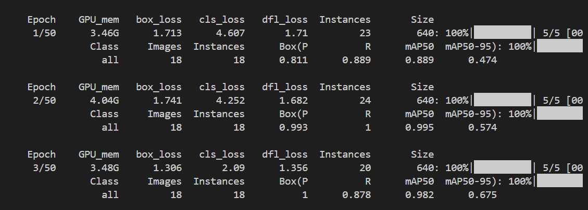
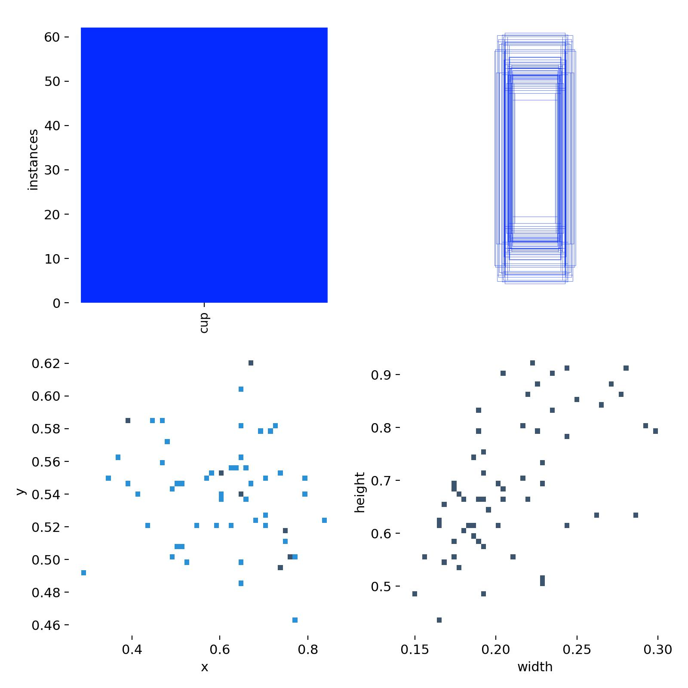

# YOLO实践文档

**       作者：张航铭**

# YOLO V8环境配置

万事开头难。这里我们来讲yolo v8的环境配置。\(这里主播用的是windows电脑\)

## 安装anaconda

首先，你需要在你的电脑上安装anaconda3:
这里介绍一下什么是anaconda3:
Anaconda 是一个专为数据科学和机器学习等领域设计的**开源 Python 发行版**。它极大地简化了 Python 环境的设置、第三方库的安装以及项目依赖的管理。你可以把它想象成一个功能强大的“超级工具箱。

conda是里面的核心组件，既是包管理器，也是环境管理器。（这里先知道这个东西，后面会经常和这个打交道的）

具体怎么安装？在[Download Anaconda Distribution \| Anaconda](https://www.anaconda.com/download)官网进行下载，这里主播就不详细讲解了（实在不会的网上教程也很多），唯一注意的几点就是：
1\.最好以管理员方式运行；

2\.最好不要安装在c盘，anaconda的占用内存比较大；

3\.不要有中文路径；

4\.记得勾选添加到环境变量。


## 安装YOLO需要的依赖


首先，先进入anaconda的python环境：
输入指令：

```Bash
conda activate base
```

这个的目的是为了激活anaconda环境：
然后，再在anaconda的环境下，新建一个YOLO　V8的环境：

```Bash
conda create -n v8 python==3.8
```

输入以下命令:

```Bash
conda env list
```

现在应该可以弹出这个环境下的所有小环境,应该会有你刚刚创建的V8:


可以看到,我们的v8已经创建好了

然后,我们在终端输入以下指令:


```Bash
conda activate v8
```

这个的目的和之前一样,激活v8的环境

正常情况下,前面的标志应该会从base切换到v8:


如果发现没有切换,那么请重新关闭vscode,再次进入\.

接下来就是安装pytorch,cuda,cudnn了:
先来介绍一下什么是pytorch:pytorch是核心的深度学习的框架,基于python语言构建的\.

CUDA​（Compute Unified Device Architecture）是NVIDIA开发的通用并行计算平台和编程模型。它允许开发者利用GPU的强大并行计算能力来加速各种计算密集型任务;cuDNN​（CUDA Deep Neural Network library）是建立在CUDA之上的深度学习加速库，专门为深度神经网络中的常见操作提供高度优化的实现\.

**简单来说,两个是配置GPU的\.\(因为YOLO本质是目标检测,就会有图像,如果不配置GPU,在训练模型的时候就只能依靠CPU,这是十分缓慢的\.GPU是专门针对图像处理\)**

安装命令:

终端输入:

```Bash
conda install pytorch==1.10.0 torchvision==0.11.0 torchaudio==0.10.0 cudatoolkit=11.3 -c pytorch
```

但是，一定要先确保你的电脑上有

这个是下载cuda和cudnn的,也就是在你的v8环境下配置GPU

可能下载时间会比较慢一点\.请耐心等待\.

由于下载的占用内存较大,请先确保电脑有充足的内存\.

下载过程中可能网络经常会崩,不要慌张,再输入上面的命令即可\.


并且在文件夹下新建一个requirements\.txt文件\(这个文件的作用是可以一键安装需要的包\)

```Bash
matplotlib==3.7.5
numpy==1.23.0
opencv-python==4.10.0.84
Pillow==9.5.0
PyYAML==6.0.2
requests==2.32.3
scipy==1.10.1
tqdm==4.67.0
tensorboard==2.14.0
pandas==2.0.3
seaborn==0.13.2
setuptools==59.5.0
easydict==1.13
imutils==0.5.4
ultralytics==8.2.103
# mirrors (optional, use -i to override index):
# https://pypi.tuna.tsinghua.edu.cn/simple
# https://mirrors.aliyun.com/pypi/simple/
# https://pypi.douban.com/simple/
```

然后在终端输入:


```Bash
pip install -r .\requirements.txt --index-url http://mirrors.aliyun.com/pypi/simple/ --trusted-host mirrors.aliyun.com
```

这里使用阿里源和清华源都可以\(具体细节可以去问ai\)

做到这一步后,那么,你的YOLO的环境应该是配置完成了\!\(给自己一个大拇指\)

在进行敲代码之前,一定要记得切换python编译器为你之前配置的\(不然有些包会显示无法解析\):


## YOLO V8代码架构

万事俱备,我们就把官网上的YOLO V8架构文件直接克隆在我们的项目文件夹里面

```Bash
git clone https://github.com/ultralytics/ultralytics
```

克隆后,现在你的项目文件应该长这样:


在这个文件夹中,大部分的文件我们都是用不到的\.我们只用重点关注ultralytics文件夹里面的内容即可\.现在我对这个文件夹里面的部分进行一个讲解:


数据集的yaml文件:YAML 文件是一种专门用于配置和数据交换的人类可读数据序列化格式。


最主要的是用V8的yaml文件\.


数据集加载处理文件,转换等一系列脚本\.


训练,评估和推理有关核心代码\.\(用的不多,大多都是配置文件\)


模块定义文件\.

## 开始你的第一个YOLO项目


在配置好环境后，我们可以先用官方的的示例图片来先确定一下环境配置，包的安装是否正确。
可以看到assets文件夹\(这个文件夹是数据集文件夹，之前有提到过\)：


里面有两张图，现在我们需要先把weights文件夹放进我们的项目文件夹下：


这里主播把它放在下面了，直接把它复制到你的项目文件夹下即可。

像这样：


先来解释一下什么是weights文件：
yolov8n\.pt

yolov8s\.pt

yolov8m\.pt

yolov8l\.pt

yolov8x\.pt

这些是什么

它们是 YOLOv8 的**预训练检测模型**（COCO 数据集），从小到大分别是 n \< s \< m \< l \< x。

取舍关系：模型越大，通常精度越高、推理越慢、显存占用越多；n/s 更适合速度优先或设备受限，l/x 更适合追求精度的场景。

怎么用

命令行预测（已在 v8 GPU 环境就绪）：

使用小模型：model=weights\\yolov8n\.pt

平衡方案：model=weights\\yolov8s\.pt 或 yolov8m\.pt

追求精度：model=weights\\yolov8l\.pt 或 yolov8x\.pt

在终端输入：

```Bash
C:\Users\lenovo\.conda\envs\v8\Scripts\yolo.exe task=detect mode=predict model=yolov8s.pt source="ultralytics\ultralytics\assets" device=0
 imgsz=640
 
```

**命令逐项解释：**

C:\\Users\\lenovo\.conda\\envs\\v8\\Scripts\\yolo\.exe：使用 v8 环境里的 YOLO 可执行文件，避免 PATH 误指向其他环境。

task=detect：选择“目标检测”任务。

mode=predict：运行推理（不是训练或验证）。

model=yolov8s\.pt：指定要加载的模型权重/配置。

source="ultralytics\\ultralytics\\assets"：要推理的图片目录。

device=0：使用 GPU 0（你已配置好 CUDA）。

imgsz=640：推理分辨率。

运行后，终端应该会这样：


然后会生成一个runs的文件夹，里面就是训练后得到的图片标注：


如果做到这一步，恭喜你！YOLO大门正在向你打开！

但是，光用别人训练好的模型远远不够的，接下来我们将会自己训练模型，然后进行识别，相信你做完后，一定会特别有成就感！

## 训练自己的数据集

这里，我们以识别蓝色水瓶作为我们的项目。我将手把手带你去搭建自己的YOLO框架。

首先，我们需要在v8环境下，搭建我们的框架：框架如下：（仅供参考，但是建议第一次训练模型的时候可以先跟着我做）


接下来，我将一个一个给大家讲解这些文件的意义（请你们也按照我的文件格式进行设置）


```Markdown
# 数据集配置（请按需修改 names 与 path）
path: C:/Users/lenovo/Desktop/GSing--opencv/YOLO_practice/yolo_v8/data
train: images/train
val: images/val
# test: images/test  # 可选

# 类别列表（顺序决定 ID；只有杯子一类时，保持如下）
names:
  - cup

```

**data\.yaml文件：**是YOLOV8的数据配置文件，它告诉YOLO模型可以在哪里找到训练数据和如何理解这些数据。


path: C:/Users/lenovo/Desktop/GSing\-\-opencv/YOLO\_practice/yolo\_v8/data:这个是数据的路径，请根据实际情况进行修改（注意❗路径不要有中文！！！）


train:images/train 训练集路径

val：images/val 验证集路径

names:类别名称列表

**Data 文件夹：**

这个是用来存放训练集和验证集的文件夹，大家就先按照教程新建文件夹就好。

**src文件夹：**

这个是主文件夹。里面包含了一些脚本文件，包含实时拍照，标注，模型训练等等。

**正式开始用YOLO进行训练：**

1. **采集**

```Python
import cv2
import os
import time
from datetime import datetime
import numpy as np

# 保存目录：相对当前脚本位置
ROOT = os.path.dirname(os.path.dirname(__file__))
IM_DIR = os.path.join(ROOT, 'data', 'images', 'train')
os.makedirs(IM_DIR, exist_ok=True)

def main():
    cap = cv2.VideoCapture(0, cv2.CAP_DSHOW)  # Windows 推荐 CAP_DSHOW 减少延迟
    if not cap.isOpened():
        raise RuntimeError('无法打开摄像头（索引 0）。请检查摄像头权限或更换索引。')

    print('提示:')
    print('  空格: 保存当前帧到 images/train')
    print('  v: 开/关垂直翻转 (镜像)')
    print('  q: 退出')

    mirror = True
    idx = int(time.time())  # 从时间戳开始计数，尽量避免重名

    while True:
        ok, frame = cap.read()
        if not ok:
            print('读取帧失败，尝试重新连接...')
            time.sleep(0.1)
            continue

        if mirror:
            frame_show = cv2.flip(frame, 1)
        else:
            frame_show = frame

        cv2.putText(frame_show, 'Space: capture | v: mirror | q: quit', (10, 30),
                    cv2.FONT_HERSHEY_SIMPLEX, 0.7, (0, 255, 0), 2)
        cv2.imshow('Capture - Press Space to Save', frame_show)

        key = cv2.waitKey(1) & 0xFF
        if key == ord('q'):
            break
        elif key == ord('v'):
            mirror = not mirror
        elif key == 32:  # Space
            # 文件名：cap_YYYYmmdd_HHMMSS_ms_idx.jpg
            ts = datetime.now().strftime('%Y%m%d_%H%M%S_%f')[:-3]
            fname = f'cap_{ts}_{idx:06d}.jpg'
            fpath = os.path.join(IM_DIR, fname)
            # 说明：某些 Windows + OpenCV 环境在含中文路径下 cv2.imwrite 可能失败
            # 为提升兼容性，使用 imencode + tofile 的方式保存（支持 Unicode 路径）
            try:
                ok, buf = cv2.imencode('.jpg', frame_show)
                if not ok:
                    raise RuntimeError('imencode 失败')
                # tofile 支持含中文的路径
                buf.tofile(fpath)
                # 再次校验文件是否存在
                if os.path.isfile(fpath) and os.path.getsize(fpath) > 0:
                    print('已保存:', os.path.normpath(fpath))
                else:
                    print('保存失败（未知原因）:', os.path.normpath(fpath))
            except Exception as e:
                print('保存失败:', e)
            idx += 1

    cap.release()
    cv2.destroyAllWindows()

if __name__ == '__main__':
    main()

```

这个文件是开启拍照功能，并保存到数据集里面的功能。按空格保存。

这一步需要你将水瓶进行拍照，远处，近处，斜着摆放，竖着摆放等。作为训练集。主播大概拍了60多张图片，一般来说，拍的越多，最后的效果就会越好。

大概就像这样👇


2. **标注:这一步很简单，运行程序后，会让你一个一个手工标记水瓶的位置。保存后，会在labels文件夹下生成每个照片的txt文件**

```Python
import os
import cv2
import glob

# 简易单类标注器（默认类名: cup -> class id = 0）
# 操作说明：
#  - 鼠标左键拖拽画框，多框可叠加
#  - d 删除最后一个框；c 清空所有框
#  - n 下一张；p 上一张
#  - s 保存为 YOLO 标签（与图片同名 .txt）
#  - q 退出

ROOT = os.path.dirname(os.path.dirname(__file__))
IM_DIR = os.path.join(ROOT, 'data', 'images', 'train')  # 需要标注的图片目录
LBL_DIR = os.path.join(ROOT, 'data', 'labels', 'train')  # 标签输出目录
os.makedirs(LBL_DIR, exist_ok=True)

class BoxTool:
    def __init__(self, img_path):
        self.img_path = img_path
        self.img = cv2.imread(img_path)
        if self.img is None:
            raise RuntimeError(f'无法读取图片: {img_path}')
        self.h, self.w = self.img.shape[:2]
        self.clone = self.img.copy()
        self.boxes = []  # [(x1,y1,x2,y2)]
        self.drawing = False
        self.x1 = self.y1 = self.x2 = self.y2 = 0
        self.dirty = False  # 是否有未保存的改动

    def mouse(self, event, x, y, flags, param):
        if event == cv2.EVENT_LBUTTONDOWN:
            self.drawing = True
            self.x1, self.y1 = x, y
            self.x2, self.y2 = x, y
        elif event == cv2.EVENT_MOUSEMOVE and self.drawing:
            self.x2, self.y2 = x, y
        elif event == cv2.EVENT_LBUTTONUP:
            self.drawing = False
            x1, y1 = min(self.x1, x), min(self.y1, y)
            x2, y2 = max(self.x1, x), max(self.y1, y)
            if x2 - x1 > 3 and y2 - y1 > 3:
                self.boxes.append((x1, y1, x2, y2))
                self.dirty = True

    def draw(self):
        canvas = self.img.copy()
        # 当前框
        if self.drawing:
            cv2.rectangle(canvas, (self.x1, self.y1), (self.x2, self.y2), (0, 255, 255), 2)
        # 历史框
        for (x1, y1, x2, y2) in self.boxes:
            cv2.rectangle(canvas, (x1, y1), (x2, y2), (0, 255, 0), 2)
        return canvas

    def save_label(self):
        # 保存 YOLO 标签：class cx cy w h (相对值)
        name = os.path.splitext(os.path.basename(self.img_path))[0]
        out = os.path.join(LBL_DIR, name + '.txt')
        if not self.boxes:
            print('无框，未保存:', out)
            return
        lines = []
        for (x1, y1, x2, y2) in self.boxes:
            cx = ((x1 + x2) / 2) / self.w
            cy = ((y1 + y2) / 2) / self.h
            w = (x2 - x1) / self.w
            h = (y2 - y1) / self.h
            lines.append(f"0 {cx:.6f} {cy:.6f} {w:.6f} {h:.6f}")
        with open(out, 'w', encoding='utf-8') as f:
            f.write('\n'.join(lines))
        print('已保存标注:', out)
        self.dirty = False

def main():
    images = []
    for ext in ('*.jpg', '*.jpeg', '*.png', '*.bmp'):
        images.extend(glob.glob(os.path.join(IM_DIR, ext)))
    images.sort()
    if not images:
        print('未在 images/train 下找到图片，请先使用 capture.py 采集。')
        return

    idx = 0
    win = 'Labeler - cup'
    cv2.namedWindow(win, cv2.WINDOW_NORMAL)

    while True:
        tool = BoxTool(images[idx])
        cv2.setMouseCallback(win, tool.mouse)
        print(f'[{idx+1}/{len(images)}] -> {images[idx]}')

        while True:
            canvas = tool.draw()
            # 叠加提示信息
            cv2.putText(canvas, 'S:保存  D:撤销  C:清空  N/P:下一/上一  Q:退出', (10, 30),
                        cv2.FONT_HERSHEY_SIMPLEX, 0.7, (0, 255, 0), 2)
            cv2.putText(canvas, f'boxes: {len(tool.boxes)}', (10, 60),
                        cv2.FONT_HERSHEY_SIMPLEX, 0.7, (0, 255, 255), 2)
            cv2.imshow(win, canvas)
            k = cv2.waitKey(10) & 0xFF
            if k == ord('q'):
                # 退出前自动保存未保存的框
                if tool.boxes and tool.dirty:
                    tool.save_label()
                cv2.destroyWindow(win)
                return
            elif k == ord('d'):
                if tool.boxes:
                    tool.boxes.pop()
                    tool.dirty = True
            elif k == ord('c'):
                tool.boxes.clear()
                tool.dirty = True
            elif k == ord('s'):
                tool.save_label()
            elif k == ord('n'):
                # 下一张前自动保存
                if tool.boxes and tool.dirty:
                    tool.save_label()
                # 下一张
                break
            elif k == ord('p'):
                # 上一张：在外层处理
                if tool.boxes and tool.dirty:
                    tool.save_label()
                idx = max(idx - 2, -1)  # 外层+1 后得到 idx-1
                break

        idx += 1
        if idx >= len(images):
            print('已到最后一张。')
            break

    cv2.destroyAllWindows()

if __name__ == '__main__':
    main()

```

在labels下的train文件夹下生成的图片

每个图片的txt文件示例：
0 0\.750000 0\.512500 0\.243750 0\.912500

这是YOLO格式的标注文件，它描述了一张图片中一个目标物体的位置和类别信息。

|数值|含义|具体解释|数据示例|
|---|---|---|---|
|0|类别ID|表示物体类别编号|0=cup|
|0\.750000|中心点x|边界框中心的水平位置|图片宽度75％|
|0\.512500|中心点y|边界框中心的垂直位置|图片高度的51\.25％|
|0\.243750|边界框宽度|物体边界框的宽度|图片宽度的24\.375％|
|0\.912500|边界框高度|边界框的高度|图片高度的91\.25％|

3. **划分验证集（建议手动挑 15%\-20% 图片移动到 val，并同步移动同名 \.txt 标签）。**

放进验证集的照片一定和生成的\.txt对应。

4. **修改类别**

**编辑 ****`configs/data.yaml`**** 的 ****`names`**** 列表即可（顺序即类别 ID）。（这里可以不用修改，如果后面有更多的标注的类型，需要添加）**

5. **训练**

```Plain Text
python yolo_v8/src/train.py
```

默认使用 `weights/yolov8s.pt`，无则自动下载 `yolov8s.pt`。

yolov8s\.pt之前在上一步已经安装在weights下，所以直接运行train\.py就好。

```Python
from ultralytics import YOLO
import os

# 默认使用项目 weights 下的 yolov8s.pt，若无可写成 'yolov8s.pt' 触发下载
ROOT = os.path.dirname(os.path.dirname(__file__))
WEIGHTS = os.path.join(os.path.dirname(ROOT), 'weights', 'yolov8s.pt')
DATA = os.path.join(ROOT, 'configs', 'data.yaml')

if __name__ == '__main__':
    model_path = WEIGHTS if os.path.exists(WEIGHTS) else 'yolov8s.pt'
    model = YOLO(model_path)
    model.train(
        data=DATA,
        epochs=50,  #训练轮次，次数越多，最后效果可能会更好，但是耗时会更长
        imgsz=640,
        batch=-1,          # 自动选择 batch size，批量大小
        device=0,          # 无 GPU 时可改为 'cpu'
        workers=0          #数据加载进程数， Windows 上更稳，卡顿可改 2-4
    )

```


现在就开始训练啦！
这里对终端的输出做一些解释：


👆这张图是 YOLOv8 模型的自动批处理（AutoBatch）基准测试结果，它展示了你的 GPU



👆这张图显示的是 YOLOv8 模型训练过程中的实时监控信息

|指标|含义|数据解读|
|---|---|---|
|epoch|训练轮次|当前是第1\-3轮/总共50轮|
|GPU\_mem|GPU显存使用|3\.46\-4\.04G 使用正常|
|instance|每批处理的实例数|20\-24个标注目标|

损失函数指标：

|指标|含义|
|---|---|
|P|精确度|
|R|召回率|
|mAP50|平均精度|

|损失类型|作用|
|---|---|
|box\_loss|边界框定位精度|
|cls\_loss|分类准确度|
|dfl\_loss|分布聚焦损失|


训练完后，会生成best\.pt，训练好的权重模型。


👇这个是训练的结果图：





**6\. 推理**

python yolo\_v8/src/predict\.py

使用 \`runs/detect/train/weights/best\.pt\`（若存在），否则使用 \`yolov8s\.pt\`。

```Python
from ultralytics import YOLO
import os

ROOT = os.path.dirname(os.path.dirname(__file__))
DATA_IMAGES = os.path.join(ROOT, 'data', 'images', 'val')  # 可改为任意图片/文件夹/视频/摄像头索引

if __name__ == '__main__':
    # 优先使用训练产物 best.pt；否则退回到预训练 yolov8s.pt
    best = os.path.join('runs', 'detect', 'train', 'weights', 'best.pt')
    model_path = best if os.path.exists(best) else 'yolov8s.pt'

    model = YOLO(model_path)
    model.predict(
        source=DATA_IMAGES,
        imgsz=640,
        device=0,   # 无 GPU 可改 'cpu'
        save=True
    )
```


运行后，会生成一个predict文件夹：


类似这种👆

到了这一步，你的模型就基本上训练完成啦！

现在我写一个脚本，打开摄像头，看看识别的效果怎么样吧！


```Python
import os
import time
from datetime import datetime

import cv2
from ultralytics import YOLO

try:
    import torch
    CUDA_OK = torch.cuda.is_available()
except Exception:
    CUDA_OK = False

# 路径解析
SRC_DIR = os.path.dirname(__file__)
PROJ_ROOT = os.path.dirname(SRC_DIR)               # yolo_v8
REPO_ROOT = os.path.dirname(PROJ_ROOT)             # 工程根目录
BEST = os.path.join(REPO_ROOT, 'runs', 'detect', 'train', 'weights', 'best.pt')
FALLBACK = os.path.join(REPO_ROOT, 'weights', 'yolov8s.pt')  # 没有 best.pt 时作为演示
SNAP_DIR = os.path.join(PROJ_ROOT, 'data', 'images', 'cam')
os.makedirs(SNAP_DIR, exist_ok=True)

def choose_model_path():
    if os.path.exists(BEST):
        print('使用训练好的模型:', os.path.normpath(BEST))
        return BEST
    if os.path.exists(FALLBACK):
        print('未找到 best.pt，回退到:', os.path.normpath(FALLBACK))
        return FALLBACK
    print('未找到本地权重，将使用在线权重: yolov8s.pt（首次会自动下载）')
    return 'yolov8s.pt'

def open_camera(index: int = 0, width: int = 1280, height: int = 720):
    cap = cv2.VideoCapture(index, cv2.CAP_DSHOW)
    if not cap.isOpened():
        raise RuntimeError(f'无法打开摄像头（索引 {index}）。请检查设备或尝试其他索引。')
    # 尝试设置分辨率
    cap.set(cv2.CAP_PROP_FRAME_WIDTH, width)
    cap.set(cv2.CAP_PROP_FRAME_HEIGHT, height)
    return cap

def main():
    model_path = choose_model_path()
    device = 0 if CUDA_OK else 'cpu'
    print('推理设备:', 'CUDA:0' if device == 0 else 'CPU')

    model = YOLO(model_path)

    cap = open_camera(index=0)
    win = 'YOLOv8 Webcam - Q退出 S截图'
    cv2.namedWindow(win, cv2.WINDOW_NORMAL)

    t0 = time.time()
    frames = 0

    try:
        while True:
            ok, frame = cap.read()
            if not ok:
                print('读取摄像头失败，重试中…')
                time.sleep(0.05)
                continue

            # 推理（对 ndarray 直接推理），不打印详细日志
            results = model.predict(source=frame, imgsz=640, conf=0.5, device=device, verbose=False)
            # 取第一张图的结果并绘制
            im_vis = results[0].plot()

            # 叠加 FPS 和提示
            frames += 1
            dt = time.time() - t0
            fps = frames / dt if dt > 0 else 0.0
            cv2.putText(im_vis, f'FPS: {fps:.1f}', (10, 30), cv2.FONT_HERSHEY_SIMPLEX, 0.9, (50, 220, 50), 2)
            cv2.putText(im_vis, 'Q: 退出   S: 截图到 data/images/cam', (10, 60), cv2.FONT_HERSHEY_SIMPLEX, 0.7, (50, 220, 220), 2)

            cv2.imshow(win, im_vis)
            k = cv2.waitKey(1) & 0xFF
            if k == ord('q'):
                break
            elif k == ord('s'):
                ts = datetime.now().strftime('%Y%m%d_%H%M%S_%f')[:-3]
                out = os.path.join(SNAP_DIR, f'cam_{ts}.jpg')
                # 兼容中文路径
                ok, buf = cv2.imencode('.jpg', im_vis)
                if ok:
                    buf.tofile(out)
                    print('已保存截图:', os.path.normpath(out))
                else:
                    print('保存失败：imencode 失败')
    finally:
        cap.release()
        cv2.destroyAllWindows()

if __name__ == '__main__':
    main()

```


你成功了吗？


