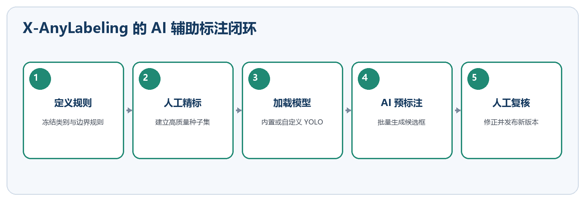
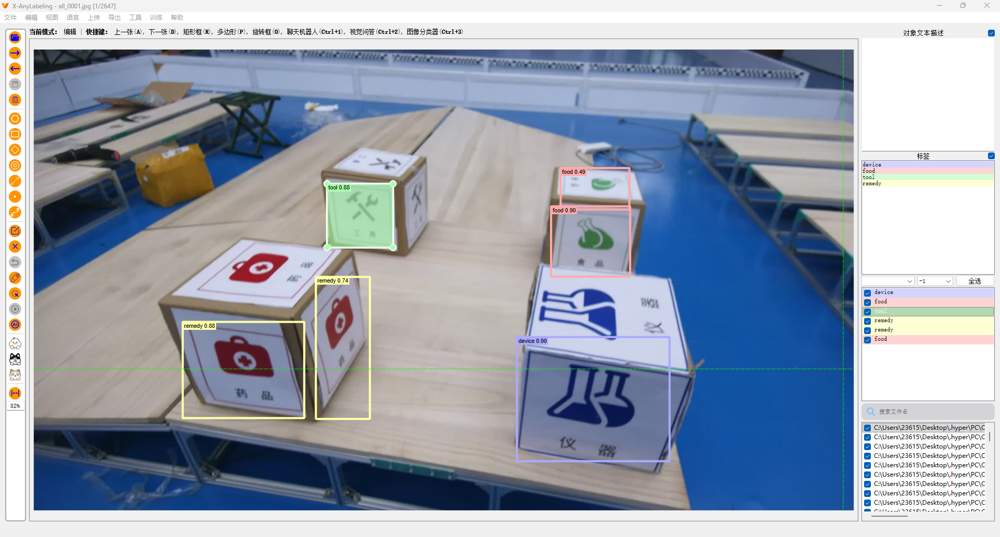

# 数据集与 X\-AnyLabeling

**数据集与 X\-AnyLabeling**

数据规范、AI 预标注与自定义 YOLO 模型

图 1  AI 预标注不能替代人工复核

图 2  X\-AnyLabeling AI 辅助检测界面示例

|**核心原则  **模型只生成候选标签；标注员必须检查类别、边界、漏标、重复框和遮挡规则。|
|---|

# 1\. 数据集准备

1. 冻结类别名称、class id、目标边界和遮挡规则。

2. 按采集场次划分 train/val/test，禁止相邻视频帧跨集合泄漏。

3. 覆盖强弱光、反光、遮挡、运动模糊、不同距离和复杂背景。

4. 数据版本不可原地覆盖；训练结果必须记录数据版本。

dataset\_v001/
  images/train/        \# 训练图片
  images/val/          \# 验证图片
  images/test/         \# 独立测试图片
  labels/train/        \# 与训练图片同名的 YOLO TXT 标签
  labels/val/          \# 验证标签
  labels/test/         \# 测试标签
  dataset\.yaml         \# 数据路径与类别顺序
  README\.md            \# 版本、来源、变更与已知偏差

# 2\. AI 自动标注

5. 按 Ctrl\+A 或点击左侧 AI 图标进入自动标注。

6. 从模型列表选择内置模型；首次使用可能自动下载到 xanylabeling\_data/models。

7. 网络无法下载时，从 Model Zoo 复制匹配的配置，下载权重并修改 model\_path。

8. 运行当前图片或批处理，逐张复核后标记为已检查。

# 3\. 调用自定义 YOLO 模型

- 优先选择 X\-AnyLabeling 已适配的 YOLO 类型；未适配模型需要额外实现推理代码，不能只改 YAML。

- 通常先把 best\.pt 导出为固定输入尺寸的 ONNX，再复制同类型 Model Zoo 配置。

\# 以下配置以官方 YOLO 示例字段为参考；type/name 应沿用所选适配模板。
type: yolov5                         \# 模型适配器类型，不可随意自造
name: yolov5s\-r20230520             \# 模型索引名，沿用模板更稳妥
provider: GSing                     \# 模型提供者，可按团队修改
display\_name: GSing Material YOLO   \# 软件下拉列表中显示的名称
model\_path: D:/models/best\.onnx     \# ONNX 权重路径；Windows 注意路径写法
iou\_threshold: 0\.45                 \# NMS 重叠阈值，控制重复框抑制
conf\_threshold: 0\.25                \# 置信度阈值，过高会增加漏标
max\_det: 300                        \# 单张图片最多保留的检测数量
classes:                            \# 顺序必须与训练 dataset\.yaml 完全一致
  \- device
  \- food
  \- tool
  \- remedy

- 在模型下拉列表选择 Load Custom Model，导入 YAML；先用少量已知图片验证类别、框和置信度，再批量标注。

# 4\. 质量验收

- 图片与标签一一对应，无越界框、空标签和非法 class id。

- 重点复核小目标、画面边缘、密集目标、遮挡和反光样本。

- 随机可视化至少 10%；新标注员首批数据检查 100%。

- 测试集保持独立，不直接使用未经复核的 AI 标签。

# 网页教程与参考资料

- [X\-AnyLabeling 项目仓库](https://github.com/CVHub520/X-AnyLabeling) — 下载、版本与 Model Zoo

- [官方用户指南](https://github.com/CVHub520/X-AnyLabeling/blob/main/docs/en/user_guide.md) — 界面、保存、复核状态与配置

- [官方自定义模型指南](https://github.com/CVHub520/X-AnyLabeling/blob/main/docs/en/custom_model.md) — 模型加载、ONNX 与 YAML 字段

