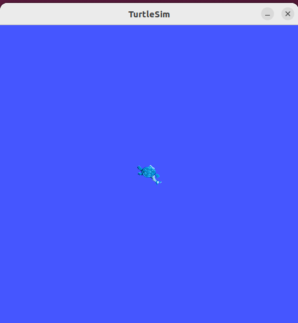
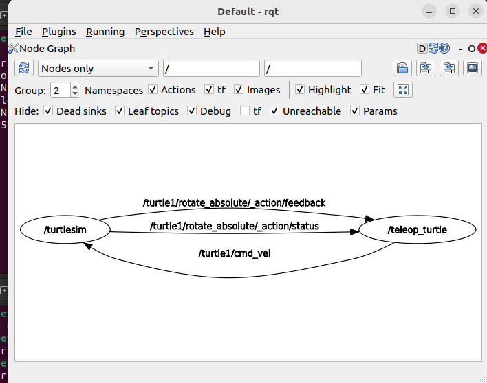

# ROS2 learning

2025\.7\.8

# 一\. 概述与环境搭建

## 1\.1 ROS\( Robot Operating System\)概念

Willow Garage公司于2007年发布的开源机器人通用分布式系统, 历经数年的迭代与完善, ROS已经成为了机器人领域的事实标准\.

ROS的缔造者将其表述为ROS = Plumbing \+ Tools \+ Capabilities \+ Ecosystem, 即通讯机制, 工具软件包, 机器人高层技能和机器人生态的集合

## 1\.2 ROS安装

首先应该有虚拟机, ubuntu 配置好共享文件夹和剪贴板, 然后小鱼一键安装🙏🏻

# 二\. Linux 初步

## 命令格式

```Plain Text
命令 [选项] [参数]
```

---

## `ls` 命令（list）

```Bash
ls [-a -l -h] [linux路径]
```

- `ls` 不加参数：以平铺方式列出当前目录内容（默认是 `/home/用户名`）。

- `ls /`：查看根目录下的文件。

- `ls -a`：列出所有文件（包括隐藏文件，隐藏文件以 `.` 开头），`a` 表示 all。

- `ls -l`：以列表形式竖向展示内容，`l` 表示 list。

- 选项可以组合使用，如：`-la`, `-al`, `-l -a` 都表示“以列表形式展示所有文件”。

- `-h`：以人类可读的方式显示文件大小（KB、MB、GB），必须和 `-l` 一起使用。

---

## `cd` 命令（change directory）

```Bash
cd [linux路径]
```

- `cd` 不加参数：返回 home 目录。

- `cd` 加参数：进入指定路径。

---

## `pwd` 命令（print work directory）

```Bash
pwd
```

- 显示当前所在目录。

---

\(路径类型与特殊路径符号

```Bash
cd desktop
cd /home/itheima/desktop
```

- 相对路径：以当前目录为起点。

- 绝对路径：以根目录 `/` 为起点。

- 特殊符号：

    - `.` 表示当前目录

    - `..` 表示上一级目录

    - `~` 表示 home 目录\)

---

## `mkdir` 命令（make directory）

```Bash
mkdir [-p] 路径
```

- `-p`：如果父目录不存在，自动创建。

```Bash
mkdir ./test1              # 当前目录下创建 test1
mkdir ~/test2              # home 下创建 test2
mkdir ~/grandpa/papa/son   # 会报错
mkdir -p ~/grandpa/papa/son # 自动创建多级目录
```

---

## `touch` 命令（创建文件）

```Bash
touch 路径
```

- 查看：

    - `ls`：蓝色为文件夹，白色为文件。

    - `ls -lh`：首字母为 `d` 表示文件夹，为 `-` 表示文件。

---

## `cat` 命令（查看文件）

```Bash
cat 路径
```

---

## `more` 命令（分页查看文件）

```Bash
more 路径
```

- 与 `cat` 区别：

    - `cat` 一次显示全部内容。

    - `more` 支持分页，空格翻页，`q` 退出。

---

## `less` 命令（比 more 更强）

```Bash
less 路径
```

- 支持前后翻页，已基本取代 `more`。

---

## `cp` 命令（复制文件/文件夹）

```Bash
cp [-r] 源路径 目标路径
```

- `-r`：递归复制目录


```Bash
cp ./test/word.txt ~/desktop        # 复制文件
cp -r ./test ~/desktop              # 复制整个文件夹
```

---

## `mv` 命令（移动/重命名）

```Bash
mv 路径1 路径2
```

---

## `rm` 命令（删除）

```Bash
rm [-r -f] 路径...
```

- `-r`：删除文件夹

- `-f`：强制删除（无确认）

---

## 通配符 `*` 与模糊匹配

- `test*`：以 test 开头

- `*test`：以 test 结尾

- *`test`*：包含 test

```Bash
rm -rf /*   #强制删除根目录下所有文件和文件夹, 跑路
```

---

## `which` 命令（查找命令文件位置）

```Bash
which 命令名
```

---

## `find` 命令（查找文件）

```Bash
find 路径 -name "文件名"
find 路径 -size +10K
```

- `-name` 支持通配符 `*`

- `-size` 后缀：

    - `K`：KB

    - `M`：MB

    - `G`：GB

```Bash
find / -name "test1"
find / -size +10K
find / -size -5G
```

---

## `grep` 命令（关键词搜索）

```Bash
grep [-n] "关键词" 文件路径
```

- `-n`：显示行号

```Bash
grep -n "linux" ~/AllenNori.txt
```

---

## `wc` 命令（统计信息）

```Bash
wc [-c -m -l -w] 文件路径
```

- `-c`：字节数

- `-m`：字符数

- `-l`：行数

- `-w`：单词数

---

## 管道符 `|`（将前一个命令的输出传给后一个命令）

```Bash
cat ./itheima.txt | grep "Linux"
cat ./itheima.txt | wc -w
ls | grep "test"
cat test.txt | grep "linux" | wc -l
```

---

## `echo` 命令（输出内容）

```Bash
echo "Hello World"
```

---

## 反引号 `` ``（将命令结果作为值）

```Bash
echo pwd        # 输出文字 "pwd"
echo `pwd`      # 输出当前路径
```

---

## 重定向符 `>` 和 `>>`

- `>`：覆盖写入

- `>>`：追加写入

```Bash
echo "Hello Linux" > itheima.txt
echo "Hello Allen" >> itheima.txt
pwd >> itheima.txt
```

---

## `tail` 命令（查看文件尾部）

```Bash
tail [-f -n] 路径
```

- `-f`：实时追踪

- `-n`：查看尾部 N 行（默认 10 行）

```Bash
tail -5 ./test.txt
tail -f ./test.txt
```

---

## `vi` / `vim` 编辑器

### 概述

- `vi` 是经典文本编辑器，`vim` 是其增强版。

### 三种模式

1. 命令模式（默认进入）

2. 编辑模式：按 `i` 进入

3. 底线命令模式：按 `:` 进入

### 启动编辑器

```Bash
vi 文件路径
vim 文件路径
```

- 文件不存在则创建

- 常用保存退出命令：`Esc` → `:wq`

### 命令模式常用快捷键

### 底线命令

## nano

nano是安装ubuntu系统时自带的文本编辑工具\(\)

### 启动编辑器

```Plain Text
nano [linux路径]
```

- 文件不存在时或没有填写路径时就自动创建

- ctrl\+o 保存  ctrl\+x退出 和常用快捷键不同, 更多快捷键在nano编辑器底部

# 三\. Hello World \!\!

## 打开小海龟

先打开终端 ctrl alt T

输入

```Plain Text
ros2 run turtlesim turtlesim_node
```

就可以看到小海龟了:



再ctrl alt T打开新终端

输入

```Plain Text
ros2 run turtlesim turtle_teleop_key
```

就可以使用键盘的上下左右来控制小海龟了

注意, 不要点击小海龟所在窗口, 应当保持turtle\_teleop\_key这个终端在最前面\( focus on\)\. 原因是, 第一个turtlesim\_node是一个程序, 这个turtle\_teleop\_key也是一个程序, 后者通过ros2提供的方式向前者发送控制指令, 由前者渲染小海龟移动, 所以键盘的操作应当在第二个终端下进行\.


对了, 按Tab可以补全或给出提示\.


## 为什么是小海龟

首先, ctrl alt T新建终端, 输入

```Plain Text
rqt
```

打开ros2自带的调试工具rqt, 在Plugin选项卡中找到Introspection/Node Graph



椭圆形包裹的叫**节点\(nodes\)** , 右边的结点通过**话题\(topics\)**为"/turtlr1/cmd\_vel"的话题通讯的方式发送来控制命令

## Hello World

Hello world是各个编程语言的经典入门代码, 为什么呢?

```Plain Text
print("hello world")
std::cout<<"hello world";
printf("hello world");
class HelloWorld {
    public static void main(String[] args) {
        System.out.println("hello world"); 
    }
}
```

如果看到了hello world , 代表着开发环境没有问题

Hello world是程序"编写 \- 运行 \- 输出"的最简化实现

Hello world 即时反馈, 让初学者能持续学习

Hello world代表着一个程序员第一次向程序世界问好


turtlesim也是一样的

如果看到了小海龟, 那么代表着开发环境没有问题

小海龟的ui让初学者光速获得反馈

小海龟的程序是ROS"节点, 话题, 通讯方式"的最简化实现

小海龟代表着一个程序员第一次向机器人世界问好

# 四\. 创建第一个python节点

## 步骤

```Python
import rclpy 
from rclpy.node import Node
def main():
    rclpy.init()#初始化工作，分配资源
    node=Node('python_node')#创建一个节点的名字
    node.get_logger().info('ros2')#打印日志，方便查看
    rclpy.spin(node)#启动节点
    rclpy.shutdown()#关闭节点
if __name__=="__main__":
    main()
```

## 运行

```Plain Text
python3 ros_python_node.py #运行python程序
ros2 node list #查看节点
```

# 五\.使用功能包创建python节点

```Plain Text
ros2 pkg create --build-type ament_python --license Apache2.0 demo_python_pkg
```

创建完成后，会在文件夹目录下生成再demo\_python\_pkg文件夹下面，创建python\_node\.py文件，相当于在功能包里面创建了节点。

创建节点后，需要在生成功能包里面的setup\.py里面，要把新创建的节点放在console\_scripts里面：


```SQL
setup(
    name=package_name,
    version='0.0.0',
    packages=find_packages(exclude=['test']),
    data_files=[
        ('share/ament_index/resource_index/packages',
            ['resource/' + package_name]),
        ('share/' + package_name, ['package.xml']),
    ],
    install_requires=['setuptools'],
    zip_safe=True,
    maintainer='zhanghangming',
    maintainer_email='zhanghangming@todo.todo',
    description='TODO: Package description',
    license='Apache2.0',
    tests_require=['pytest'],
    entry_points={
        'console_scripts': [
        'python_node=demo_python_pkg.python_node:main'
        ],
    },
)

```

python\_node=demo\_python\_pkg\.python\_node:main

这样就知道要生成一个可执行文件，名字叫python\_node,执行文件的时候，要执行python\_node文件下的main函数

在package\.xml文件\(功能包清单文件\)下，添加rclpy的依赖

```XML
 <depend>rclpy<depend>
  <test_depend>ament_copyright</test_depend>
  <test_depend>ament_flake8</test_depend>
  <test_depend>ament_pep257</test_depend>
  <test_depend>python3-pytest</test_depend>

```

做完以上操作，就可以构建功能包了，命令如下：

```Plain Text
colcon build
```

输入后，应该会生成三个文件夹，build\(中间文件\),install（结果文件）,log文件

```Plain Text
source install/setup.bash
```

setup\.bash能够帮助我们修改环境变量

运行节点：

```Plain Text
ros2 run demo_python_pkg python_node
```

注意：这里运行的是install目录下的python\_node文件

python功能包结构分析


# 六\.多功能包的最佳实践workspace

1\.创建一个工作空间,并将刚刚创建的python功能包拷贝到src目录下,并删掉build,log,install文件夹

```Plain Text
mkdir -p chapt2_ws/src
mv demo_python_pkg/ chapt2_ws/src/
rm -rf build/ install/ log/
```


