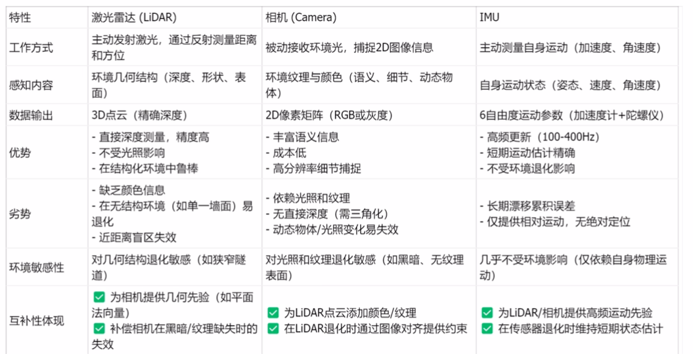

# fastlivo2 learning

# fastlivo2论文学习

## 摘要内容

重点提取：

**激光雷达\-惯性\-视觉里程计框架**

通过误差状态迭代卡尔曼滤波器的高效处理

解决异质激光雷达和图形测量之间维度不匹配的问题

激光雷达模块直接配准原始点云，无需提取边缘或平面特征

视觉模块无需提取ORB或FAST角点 即可最小提取特征

按需光线投射：只有当前图像中确实缺少视觉地图点的区域，才有针对性的进行光线投射查询，以寻找可能被遗漏的可见地图点。

原因\-\>雷达近距离盲区 相机与雷达视野差异

术语解释：
1\.异质：雷达和视觉物理原理数据类型完全不同

2\.维度不匹配：

雷达是三维 视觉是二维 导致无法直接在同一空间下进行融合或比对

## 引言

视觉slam:只能获取颜色信息，不能获取深度信息

激光雷达slam：直接获取精确的深度测量 缺乏颜色信息 

fastlivo2:结合传感器的耦合的一种算法

（这里需要思考：雷达和相机的位置？两个传感器需要保持相对固定的位置上，那么现在的设计是，摄像头在机械爪处，那么，当机械臂运动 雷达和摄像头的相对位置就改变了🤔）

## 工作梳理

## fastlivo2采用紧耦合的方式

什么是紧耦合？松耦合？

稀疏直接法和稠密直接法？

fastlivo2用的是稀疏直接法。

在视觉模块中，FAST\-LIVO2通过最小化直接光度误差进行图像对齐，但并非使用所有像素，而是采用稀疏策略。系统将当前图像划分为30×30像素的网格，在每个网格中只保留具有最大灰度梯度的候选激光点作为视觉地图点，并附加图像块（如11×11像素的多尺度金字塔）。

