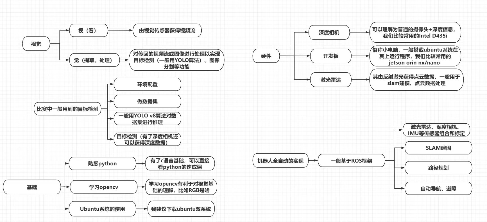

# 前置

新队员们好！欢迎来到视觉组学习！这是视觉入门的一些视频资料👇

下面的各种名词可能会让你感到陌生，不过不用担心！随着你的进一步学习，你会慢慢熟悉它们的。

为了完成以上任务，你可以通过充分利用大语言模型、搜集网上论坛资料等方式，自行探索学习路径。

GSing战队视觉组起步较晚，2025年5月份才正式成立，所以几乎没有什么积淀，因此大家都是共同学习的过程！

## 前置

### 梯子

科学上网是非常重要基础的一步，大家都需要有一个稳定的翻墙方案，这涉及到google,ai,论坛以及github的使用
推荐的代理软件是[clash verge](https://clashverge.net/)

leon用了很久的机场[sakuracat](https://sakura-cat.club/)
hyper使用的<https://csgfw.top/user>
这里仅作推荐

### GIT

git代码管理是在开发过程中十分重要的一步，需要做的是git 的安装，学习如何使用远程仓库github/gitee以及简单的指令使用，如pull,push,check,merge之类的，我们伟大的张逸飞学长写了[Git](https://xcnl2zsfzwq5.feishu.cn/wiki/QQq5wUDU7izTVZkCJdGcMUbLnmg)

### 查找问题

搜索引擎强烈建议换成[google](http://google.com),不要用百度

请学会在各个社区中查找问题，中文社区如[csdn](https://www.csdn.net/),[稀土掘金](https://juejin.cn/)，英文社区如[reddit](https://www.reddit.com/),[stack overflow](https://stackoverflow.com/questions)

也很推荐使用 ai 联网搜索，但记得一定要进行溯源

### AI

AI 是非常好用的工具，推荐大家使用[gemini](https://gemini.google.com/)来进行 AI 辅助学习，gemini 是所有 AI 中最适合当老师的，当然，也非常推荐使用豆包，kimi，智谱glm,qwen，deepseek 等等国内的优质大模型，都是免费使用的

可以使用 AI 来进行编码，也可以使用 agent，但是同时也请注意自身的代码能力，不要出现看不懂"自己写"的代码的情况，笔者本人经常使用claude进行编码工作，给大家推荐，非常好用

### IDE

首推[vs code](https://code.visualstudio.com) \(visual studio code\),这是基本万能的 ide，可能环境配置会复杂一些，但是聪明的你一定可以找到方法。vs code有着庞大的插件生态，可以满足你的需求
当然，也非常推荐JetBrains的 ide，如pycharm,clion等都非常好用。如果你有米，可以选择伟大的 curosr

这里非常建议大家去申请一个copliot学生认证[白嫖github学生认证指北](https://wcnryc3jb9ra.feishu.cn/wiki/HqQJwsd4niZSN4kkuabcz5Snnpf?from=from_parent_docs)

## 学习

**视觉框架图（未来想要做视觉的同学建议看看，形成整体的视觉框架）**

**深度学习的基本两个类型和python常用库的深度介绍**

里边有Anaconda集成和cuda、cudnn、pytorch等深度学习需要的的安装：

<https://www.bilibili.com/video/BV1cD4y1H7Tk?spm_id_from=333.788.videopod.sections&vd_source=3951012d48d805c6b1b5b4a9cf8b3d8b>

**opencv的知识：（建议先看这个，里面涉及到的二极化，边缘检测等对训练赛帮助比较大）**

<https://www.bilibili.com/video/BV1VC4y1h7wq?spm_id_from=333.788.videopod.episodes&vd_source=3951012d48d805c6b1b5b4a9cf8b3d8b&p=2>

**ros入门：**

<https://www.bilibili.com/video/BV1BP4y1o7pw/?spm_id_from=333.337.search-card.all.click>

**ubuntu linux安装：**
<https://www.bilibili.com/video/BV1554y1n7zv/?spm_id_from=333.337.search-card.all.click&vd_source=3951012d48d805c6b1b5b4a9cf8b3d8b>

学习安装linux系统，虚拟机/wsl/双系统均可，推荐安装ubuntu22\.04

linux系统比较注重命令行操作，因此在未来如果要继续学ros什么的，需要培养用命令行的习惯。

需要知道一些命令在哪里执行，了解一些linux基础命令。

fishros一键安装：

<https://fishros.org.cn/forum/topic/20/%E5%B0%8F%E9%B1%BC%E7%9A%84%E4%B8%80%E9%94%AE%E5%AE%89%E8%A3%85%E7%B3%BB%E5%88%97/1?lang=zh-CN>

**学习内容参考：**

在linux上进行软件安装以及环境配置：VSCode，ROS2，C\+\+，Python，CMake以及其他所需的依赖项等

**yoloV8,yoloV11:**

开始可能会被配环境那些搞得比较彷徨，但这都是正常的！要相信自己，肯定可以的！

<https://www.bilibili.com/video/BV13vCVYzEiJ?spm_id_from=333.788.videopod.sections&vd_source=3951012d48d805c6b1b5b4a9cf8b3d8b>

### Python

**视觉组入门推荐学习 Python**，后续的图像处理、数据处理、模型训练与调用都会经常用到。掌握一种编程语言即可，C 或 Python 都可以，不一定要学习 C，也不要求两种都学；已经会 C 的同学也可以先用熟悉的语言开展学习。

可以先学习知识库中的 [Python 速通课](<01 基础工具/Python 速通课.md>)，也可以在[菜鸟教程](https://www.runoob.com/python3/python3-tutorial.html)上学习基本语法，这部分内容新同学的话最好在 1 周内速通完，语言的学习周期不能长，在之后的实战中逐渐巩固

可以在leetcode或者洛谷上刷基础题，洛谷更偏难一些。

这部分的小练习是[练习题](https://leetcode.cn/problems/valid-parentheses/)

**结：**

**在机器人基础训练赛中，先运用python\+opencv的知识就可以了。**

